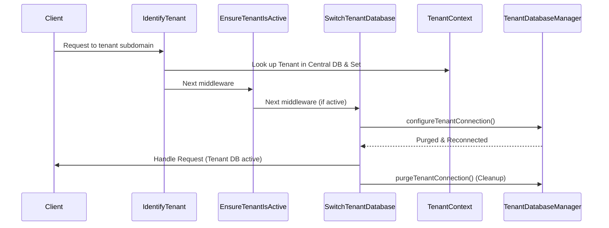

# Infrastructure

This document describes the database and application infrastructure for the multi-tenant crowdfunding platform.

---

## Database Architecture

The system uses two categories of MySQL databases served from the same MySQL server instance:

### Tenant Registry

The core identity of all tenants is stored in the **Central Database**. The `tenants` and `tenant_domains` tables act as a global registry. They store:
- Tenant identity (name, slug)
- Subdomain and custom domains
- Current status (e.g., active, suspended)
- The name of their dedicated database (`database_name`)

This registry allows the application to quickly look up a tenant and determine which database to connect to during the middleware phase, before any tenant database connections are established.

### Central Database (`crowdfund_central`)

Stores all cross-tenant and global data:

- Users (investors, agents, super admins)
- Investor profiles and KYC records
- Agent profiles and downline hierarchy
- Wallets and wallet ledger entries
- Exchange rates and exchange rate snapshots
- Commission settings and commission entries
- Payment requests (top-up, withdrawal, tenant registration fee)
- Allowed issuer countries
- Audit logs

The central database is accessed via the `central` connection defined in `config/database.php`, using `CENTRAL_DB_*` environment variables.

### Tenant Databases (`tenant_{slug}`)

Each tenant has a dedicated database that stores tenant-scoped data:

- Tenant admins
- Issuers
- Projects and project return settings
- Project investments
- Project publishing logs
- Tenant payment requests
- Tenant audit logs

Tenant databases follow the naming convention `{prefix}{slug}`, where the prefix is configured via `TENANT_DB_PREFIX` (default: `tenant_`). Examples:

```
tenant_indonesia
tenant_malaysia
tenant_singapore
```

### Why the Tenant Connection Database Name is Empty

In `config/database.php`, the `tenant` connection has `'database' => null`. This is intentional. The correct database name is only known after the HTTP request arrives and the subdomain middleware identifies which tenant is being accessed.

At runtime, the `TenantDatabaseManager` service will:

1. Receive the tenant slug from the `IdentifyTenant` middleware.
2. Construct the database name (e.g., `tenant_indonesia`).
3. Update the `tenant` connection configuration dynamically.
4. Purge and reconnect the database connection.

This approach avoids hardcoding tenant database names and supports an unlimited number of tenants without config changes.

---

## Request Flow



For main app requests (root domain), no tenant middleware runs and queries use the `central` connection.

---

## Connection Summary

| Connection | Config Key | Database | Purpose |
|---|---|---|---|
| `mysql` | `DB_*` | `crowdfund_central` | Default Laravel connection |
| `central` | `CENTRAL_DB_*` | `crowdfund_central` | Explicit cross-tenant data |
| `tenant` | `TENANT_DB_*` | *(set at runtime)* | Per-tenant isolated data |

> **Note**: In local development, the default `mysql` and `central` connections point to the same database (`crowdfund_central`). This is expected. The `central` connection exists so that models can explicitly declare `$connection = 'central'` for clarity and future-proofing.
