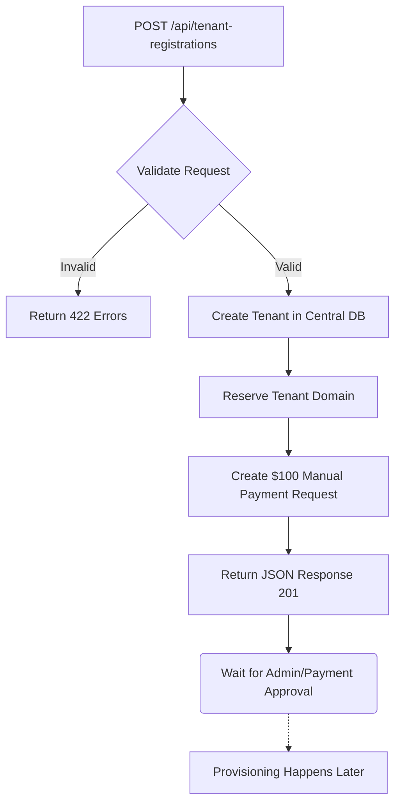

# Workflow

## Tenant Registration Workflow

```mermaid
flowchart TD
    A[POST /api/tenant-registrations] --> B{Validate Request}
    B -- Invalid --> C[Return 422 Errors]
    B -- Valid --> D[Create Tenant in Central DB]
    D --> E[Reserve Tenant Domain]
    E --> F[Create $100 Manual Payment Request]
    F --> G[Return JSON Response 201]
    G --> H(Wait for Admin/Payment Approval)
    H -.-> I[Provisioning Happens Later]
```
