# 3-Phase Implementation Plan — White-Label Multi-Tenant Crowdfunding Platform

> **Status**: PLANNING ONLY — no code changes, no migrations, no package installs yet.

---

## Project State Summary

| Item | Status |
|---|---|
| Laravel version | 12 (fresh project) |
| PHP | 8.2+ |
| DB connection | MySQL (`crowdfund_central`) |
| Queue connection | `database` (not Redis) |
| Existing migrations | 3 default Laravel (users, cache, jobs) |
| Existing models | `User` (default) |
| Existing jobs | `TestQueueJob` (placeholder) |
| Existing routes | Default welcome only |
| Existing tests | Default ExampleTest (Feature + Unit) |
| Packages installed | Only Laravel core + dev tooling |
| Python venv | `.venv` exists; `scripts/requirements.txt` has `beautifulsoup4`, `requests`, `lxml` |
| Docs | Stub files exist in `docs/` (ERD.md, WORKFLOW.md, etc.) |
| DECISIONS.md | Already populated with 18 architectural decisions |
| `config/database.php` | Only default connections — **no `central` or `tenant` connection yet** |
| `.env.example` | Already has `CENTRAL_DB_*`, `TENANT_DB_*`, `SCRAPER_*`, `MONEY_CALCULATION_SCALE` env vars |

### Verified Skills (all 18 exist under `.agents/skills/`)

| Skill | Phase(s) Used |
|---|---|
| `laravel-expert` | 1, 2, 3 |
| `laravel-security-audit` | 1, 3 |
| `backend-architect` | 1, 2 |
| `backend-dev-guidelines` | 1, 2, 3 |
| `api-design-principles` | 1, 2 |
| `api-security-best-practices` | 1, 2 |
| `auth-implementation-patterns` | 1 |
| `backend-security-coder` | 1, 3 |
| `database` | 1, 2 |
| `database-architect` | 1, 2 |
| `database-migration` | 1, 2 |
| `database-optimizer` | 2, 3 |
| `architecture-decision-records` | 1, 2, 3 |
| `documentation-and-adrs` | 1, 2, 3 |
| `error-handling-patterns` | 1, 2, 3 |
| `environment-setup-guide` | 1 |
| `code-reviewer` | 3 |
| `debugging-toolkit` | 3 |

---

## PHASE 1 — Foundation, Tenancy, Auth, Security Baseline

### 1. Goal

Establish the modular Laravel backend skeleton, central + tenant database architecture, subdomain-based tenant identification, dynamic database switching, basic auth with roles, tenant registration with `$100` manual payment, allowed issuer countries seed, and security baseline for tenant isolation.

### 2. Relevant Skills

`laravel-expert`, `backend-architect`, `backend-dev-guidelines`, `database`, `database-architect`, `database-migration`, `auth-implementation-patterns`, `api-design-principles`, `api-security-best-practices`, `backend-security-coder`, `laravel-security-audit`, `environment-setup-guide`, `error-handling-patterns`, `architecture-decision-records`, `documentation-and-adrs`

### 3. Files/Directories to CREATE

```
app/
├── Domains/
│   ├── Tenancy/
│   │   ├── Models/Tenant.php
│   │   ├── Models/TenantDomain.php
│   │   ├── Actions/RegisterTenantAction.php
│   │   ├── Actions/ProvisionTenantDatabaseAction.php
│   │   ├── Actions/ActivateTenantAction.php
│   │   ├── Services/TenantContext.php
│   │   ├── Services/TenantDatabaseManager.php
│   │   ├── Jobs/CreateTenantDatabaseJob.php
│   │   ├── Jobs/RunTenantMigrationsJob.php
│   │   └── Exceptions/TenantNotFoundException.php
│   │       Exceptions/TenantInactiveException.php
│   │       Exceptions/TenantProvisioningFailedException.php
│   │
│   ├── User/
│   │   ├── Models/  (extend existing User model)
│   │   ├── Actions/RegisterInvestorAction.php
│   │   ├── Actions/RegisterAgentAction.php
│   │   └── Services/UserRegistrationService.php
│   │
│   ├── Payment/
│   │   ├── Models/PaymentRequest.php
│   │   ├── Models/TenantRegistrationPayment.php
│   │   ├── Actions/SubmitPaymentAction.php
│   │   └── Actions/ApprovePaymentAction.php
│   │
│   └── Admin/
│       └── Models/AllowedIssuerCountry.php
│
├── Http/
│   ├── Controllers/
│   │   ├── MainApp/
│   │   │   ├── AuthController.php
│   │   │   ├── TenantRegistrationController.php
│   │   │   └── MarketplaceController.php
│   │   ├── TenantApp/
│   │   │   └── (placeholder — implemented Phase 2)
│   │   └── Admin/
│   │       ├── TenantManagementController.php
│   │       └── IssuerCountryController.php
│   │
│   ├── Middleware/
│   │   ├── IdentifyTenant.php
│   │   ├── SwitchTenantDatabase.php
│   │   └── EnsureTenantIsActive.php
│   │
│   └── Requests/
│       ├── RegisterInvestorRequest.php
│       ├── RegisterAgentRequest.php
│       ├── RegisterTenantRequest.php
│       └── LoginRequest.php
│
├── Support/
│   ├── Tenancy/
│   │   └── TenantServiceProvider.php
│   └── Enums/
│       ├── TenantStatus.php
│       ├── UserRole.php
│       └── PaymentStatus.php
│
└── Exceptions/
    └── Handler updates for domain exceptions

config/
├── tenancy.php                          [NEW]
├── money.php                            [NEW]

database/
├── migrations/
│   ├── central/                         [NEW directory]
│   │   ├── 2026_06_28_000001_add_status_to_users_table.php
│   │   ├── 2026_06_28_000002_create_tenants_table.php
│   │   ├── 2026_06_28_000003_create_tenant_domains_table.php
│   │   ├── 2026_06_28_000004_create_payment_requests_table.php
│   │   ├── 2026_06_28_000005_create_allowed_issuer_countries_table.php
│   │   └── 2026_06_28_000006_create_roles_and_permissions_tables.php
│   └── tenant/                          [NEW directory]
│       └── 2026_06_28_100001_create_tenant_admins_table.php
│
├── seeders/
│   ├── AllowedIssuerCountriesSeeder.php [NEW]
│   ├── RolesAndPermissionsSeeder.php    [NEW]
│   └── TenantDemoSeeder.php             [NEW]

routes/
├── api.php                              [NEW]
├── api_tenant.php                       [NEW]

tests/
├── Feature/
│   ├── Tenancy/
│   │   ├── TenantRegistrationTest.php
│   │   ├── TenantSubdomainIdentificationTest.php
│   │   └── TenantDatabaseSwitchingTest.php
│   └── Auth/
│       └── AuthenticationTest.php
├── Unit/
│   └── Tenancy/
│       └── TenantContextTest.php
```

### 4. Files/Directories to MODIFY

| File | Change |
|---|---|
| [composer.json](file:///c:/laragon/www/crowdfunding-assessment/composer.json) | Add `laravel/sanctum`, `spatie/laravel-permission` |
| [config/database.php](file:///c:/laragon/www/crowdfunding-assessment/config/database.php) | Add `central` and `tenant` MySQL connections |
| [config/queue.php](file:///c:/laragon/www/crowdfunding-assessment/config/queue.php) | Ensure `database` queue connection uses `central` DB |
| [config/auth.php](file:///c:/laragon/www/crowdfunding-assessment/config/auth.php) | Configure Sanctum guard |
| [.env.example](file:///c:/laragon/www/crowdfunding-assessment/.env.example) | Verify/add `MAIN_DOMAIN`, Sanctum vars |
| [app/Models/User.php](file:///c:/laragon/www/crowdfunding-assessment/app/Models/User.php) | Add `status`, `HasRoles`, `HasApiTokens`, specify `$connection = 'central'` |
| [app/Providers/AppServiceProvider.php](file:///c:/laragon/www/crowdfunding-assessment/app/Providers/AppServiceProvider.php) | Register `TenantContext` singleton, bind middleware |
| [routes/web.php](file:///c:/laragon/www/crowdfunding-assessment/routes/web.php) | Minimal — keep default welcome |
| [routes/console.php](file:///c:/laragon/www/crowdfunding-assessment/routes/console.php) | Add scheduler registration stub |
| [bootstrap/app.php](file:///c:/laragon/www/crowdfunding-assessment/bootstrap/app.php) | Register middleware aliases, API route files |
| [database/migrations/0001_01_01_000000_create_users_table.php](file:///c:/laragon/www/crowdfunding-assessment/database/migrations/0001_01_01_000000_create_users_table.php) | Add `status` column to users |
| [phpunit.xml](file:///c:/laragon/www/crowdfunding-assessment/phpunit.xml) | Add MySQL testing env vars for central + tenant |
| [database/seeders/DatabaseSeeder.php](file:///c:/laragon/www/crowdfunding-assessment/database/seeders/DatabaseSeeder.php) | Orchestrate new seeders |
| [DECISIONS.md](file:///c:/laragon/www/crowdfunding-assessment/DECISIONS.md) | Clean up trailing artifacts from PowerShell; verify content |
| [docs/INFRASTRUCTURE.md](file:///c:/laragon/www/crowdfunding-assessment/docs/INFRASTRUCTURE.md) | Add infrastructure Mermaid diagram and explanation |

### 5. Database Migrations Planned

**Central DB migrations:**

| Migration | Table | Key Columns |
|---|---|---|
| `add_status_to_users_table` | `users` (alter) | `status` enum |
| `create_tenants_table` | `tenants` | `id`, `name`, `slug`, `subdomain`, `country_code`, `currency`, `database_name`, `status`, `registration_fee_amount`, `registration_fee_currency`, `approved_at`, `activated_at`, `suspended_at` |
| `create_tenant_domains_table` | `tenant_domains` | `id`, `tenant_id`, `domain`, `is_primary` |
| `create_payment_requests_table` | `payment_requests` | `id`, `user_id`, `tenant_id`, `type`, `amount`, `currency`, `proof_file_path`, `status`, `submitted_at`, `approved_by/at`, `rejected_by/at`, `rejection_reason` |
| `create_allowed_issuer_countries_table` | `allowed_issuer_countries` | `id`, `country_code`, `country_name`, `is_enabled` |
| `create_roles_and_permissions_tables` | Spatie tables | via Spatie migration |

**Tenant DB migrations:**

| Migration | Table | Key Columns |
|---|---|---|
| `create_tenant_admins_table` | `tenant_admins` | `id`, `user_id`, `role`, `status` |

### 6. Services/Actions Planned

| Name | Type | Location |
|---|---|---|
| `TenantContext` | Service (Singleton) | `app/Domains/Tenancy/Services/` |
| `TenantDatabaseManager` | Service | `app/Domains/Tenancy/Services/` |
| `RegisterTenantAction` | Action | `app/Domains/Tenancy/Actions/` |
| `ProvisionTenantDatabaseAction` | Action | `app/Domains/Tenancy/Actions/` |
| `ActivateTenantAction` | Action | `app/Domains/Tenancy/Actions/` |
| `UserRegistrationService` | Service | `app/Domains/User/Services/` |
| `RegisterInvestorAction` | Action | `app/Domains/User/Actions/` |
| `RegisterAgentAction` | Action | `app/Domains/User/Actions/` |
| `SubmitPaymentAction` | Action | `app/Domains/Payment/Actions/` |
| `ApprovePaymentAction` | Action | `app/Domains/Payment/Actions/` |

### 7. Models Planned

| Model | DB | Connection |
|---|---|---|
| `Tenant` | central | `central` |
| `TenantDomain` | central | `central` |
| `User` (extend) | central | `central` |
| `PaymentRequest` | central | `central` |
| `AllowedIssuerCountry` | central | `central` |
| `TenantAdmin` | tenant | `tenant` (dynamic) |

### 8. Controllers Planned

| Controller | Scope | Routes |
|---|---|---|
| `AuthController` | MainApp | `POST /api/register/investor`, `POST /api/register/agent`, `POST /api/register/tenant`, `POST /api/login`, `POST /api/logout`, `GET /api/me` |
| `TenantRegistrationController` | MainApp | `POST /api/register/tenant`, `POST /api/tenant-payment` |
| `MarketplaceController` | MainApp | `GET /api/tenants` |
| `TenantManagementController` | Admin | `GET/POST /api/admin/tenants/{id}/approve-payment`, `activate`, `suspend` |
| `IssuerCountryController` | Admin | `GET/PUT /api/admin/issuer-countries` |

### 9. Middleware Planned

| Middleware | Purpose |
|---|---|
| `IdentifyTenant` | Extract subdomain → look up tenant in central DB |
| `SwitchTenantDatabase` | Dynamically set tenant DB connection |
| `EnsureTenantIsActive` | Reject request if tenant status ≠ `active` |

### 10. Jobs/Scheduler Planned

| Job | Trigger |
|---|---|
| `CreateTenantDatabaseJob` | After payment approved |
| `RunTenantMigrationsJob` | Chained after DB creation |

### 11. Tests Planned

| Test | Type |
|---|---|
| Tenant registration creates pending tenant | Feature |
| Payment submission attaches to tenant | Feature |
| Payment approval triggers provisioning | Feature |
| Tenant subdomain identifies correct tenant | Feature |
| Inactive tenant returns 403 | Feature |
| `TenantContext` returns correct tenant data | Unit |
| Auth login returns Sanctum token | Feature |
| Investor registration creates profile + wallet stub | Feature |
| Agent registration with referral code | Feature |

### 12. Documentation Updates Planned

| File | What |
|---|---|
| `DECISIONS.md` | Clean trailing PowerShell artifacts; add package justification for Sanctum & Spatie Permission |
| `docs/INFRASTRUCTURE.md` | Full Mermaid diagram of central/tenant architecture, request flow |
| `README.md` | Replace default Laravel README with project-specific content |

### 13. Security Considerations

- **Tenant isolation**: Middleware must ALWAYS run before any tenant-scoped controller; tenant DB connection is scoped to request lifecycle only
- **Auth**: Sanctum token-based API auth; passwords hashed with bcrypt (already configured rounds=12)
- **Role enforcement**: Spatie Permission middleware gates super_admin, tenant_admin, investor, agent, issuer
- **CSRF**: Not applicable for API-only; Sanctum handles token auth
- **SQL injection**: All queries via Eloquent or query builder with parameter binding
- **Mass assignment**: Explicit `$fillable` on all models
- **Tenant context leak**: `TenantContext` must be request-scoped singleton; cleared after request
- **Database credential separation**: Tenant DB uses same MySQL user for MVP but separate databases

### 14. Risks and Trade-offs

| Risk | Mitigation |
|---|---|
| Tenant DB connection leaks across requests | Request-scoped singleton + middleware teardown |
| Spatie Permission adds complexity | Worth it for configurable role/permission system vs. manual guards |
| `phpunit.xml` uses SQLite `:memory:` — incompatible with multi-DB testing | Switch to MySQL for feature tests using `RefreshDatabase` on specific connections |
| Default migration location conflict (central vs. tenant) | Separate into `database/migrations/central/` and `database/migrations/tenant/` paths |
| No existing `api.php` route file | Create it and register in `bootstrap/app.php` |

### 15. Acceptance Criteria

- [ ] `central` and `tenant` database connections defined in `config/database.php`
- [ ] Tenant model with full status lifecycle (`pending_registration` → `active`)
- [ ] Subdomain middleware correctly identifies tenant and switches DB
- [ ] Inactive tenant receives 403 response
- [ ] Tenant registration creates payment request for $100
- [ ] Payment approval dispatches `CreateTenantDatabaseJob`
- [ ] Tenant DB is created and migrations run via queue
- [ ] `AllowedIssuerCountries` seeded with 10 SEA countries
- [ ] Investor registration creates user with `investor` role
- [ ] Agent registration creates user with `agent` role
- [ ] Sanctum token returned on login
- [ ] DECISIONS.md and docs/INFRASTRUCTURE.md updated
- [ ] All Phase 1 tests pass

### 16. Commands Needed Later

```bash
# Install packages
composer require laravel/sanctum
composer require spatie/laravel-permission

# Publish Sanctum config
php artisan vendor:publish --provider="Laravel\Sanctum\SanctumServiceProvider"

# Publish Spatie Permission config and migration
php artisan vendor:publish --provider="Spatie\Permission\PermissionServiceProvider"

# Create central database
mysql -u root -e "CREATE DATABASE IF NOT EXISTS crowdfund_central"

# Run central migrations
php artisan migrate --path=database/migrations --database=central
php artisan migrate --path=database/migrations/central --database=central

# Run seeders
php artisan db:seed --class=RolesAndPermissionsSeeder
php artisan db:seed --class=AllowedIssuerCountriesSeeder

# Generate API route file
php artisan install:api  (or manually create routes/api.php)

# Queue worker for tenant provisioning
php artisan queue:work --queue=default --tries=3
```

---

## PHASE 2 — Financial Core, Project, Investment, Commission

### 1. Goal

Build the complete financial engine: investor profiles with home currency, agent profiles with hierarchy, wallet and wallet ledger, `MoneyService` with BCMath, exchange rate table with snapshot design, issuer registration per tenant, project CRUD with submission/review/publishing workflow, return settings validation, investment flow across tenants with currency conversion, and the commission engine for investor referral, agent direct, and agent override commissions.

### 2. Relevant Skills

`laravel-expert`, `backend-architect`, `backend-dev-guidelines`, `database`, `database-architect`, `database-migration`, `database-optimizer`, `api-design-principles`, `api-security-best-practices`, `error-handling-patterns`, `architecture-decision-records`, `documentation-and-adrs`

### 3. Files/Directories to CREATE

```
app/
├── Domains/
│   ├── Investor/
│   │   ├── Models/InvestorProfile.php
│   │   ├── Models/InvestorKyc.php
│   │   ├── Models/ReferralLink.php
│   │   └── Models/InvestorReferral.php
│   │
│   ├── Agent/
│   │   ├── Models/AgentProfile.php
│   │   ├── Models/AgentDownline.php
│   │   ├── Services/AgentLevelService.php
│   │   └── Actions/RecalculateAgentLevelAction.php
│   │
│   ├── Wallet/
│   │   ├── Models/Wallet.php
│   │   ├── Models/WalletLedgerEntry.php
│   │   ├── Services/WalletService.php
│   │   └── Exceptions/InsufficientWalletBalanceException.php
│   │
│   ├── ExchangeRate/
│   │   ├── Models/ExchangeRate.php
│   │   ├── Models/ExchangeRateSnapshot.php
│   │   ├── Services/ExchangeRateService.php
│   │   └── Exceptions/ExchangeRateUnavailableException.php
│   │
│   ├── Project/
│   │   ├── Models/Issuer.php                    (tenant DB)
│   │   ├── Models/Project.php                   (tenant DB)
│   │   ├── Models/ProjectReturnSetting.php      (tenant DB)
│   │   ├── Models/ProjectPublishingLog.php       (tenant DB)
│   │   ├── Actions/CreateProjectAction.php
│   │   ├── Actions/SubmitProjectAction.php
│   │   ├── Actions/ReviewProjectAction.php
│   │   ├── Actions/PublishProjectAction.php
│   │   ├── Services/ReturnValidationService.php
│   │   ├── Exceptions/ProjectNotPublishableException.php
│   │   └── Exceptions/IssuerCountryNotAllowedException.php
│   │
│   ├── Investment/
│   │   ├── Models/ProjectInvestment.php          (tenant DB)
│   │   ├── Actions/InvestAction.php
│   │   ├── Services/InvestmentService.php
│   │   └── Exceptions/InvalidMoneyCurrencyException.php
│   │
│   └── Commission/
│       ├── Models/CommissionSetting.php
│       ├── Models/CommissionEntry.php
│       ├── DTOs/CommissionLine.php
│       ├── Services/CommissionCalculator.php
│       ├── Services/ReferralCommissionService.php
│       ├── Services/AgentCommissionService.php
│       ├── Services/CommissionValidationService.php
│       └── Exceptions/CommissionExceedsPlatformMarginException.php
│
├── Http/
│   ├── Controllers/
│   │   ├── MainApp/
│   │   │   ├── WalletController.php
│   │   │   ├── ExchangeRateController.php
│   │   │   └── PaymentRequestController.php
│   │   ├── TenantApp/
│   │   │   ├── IssuerController.php
│   │   │   ├── ProjectController.php
│   │   │   ├── InvestmentController.php
│   │   │   └── InvestorProjectController.php
│   │   └── Admin/
│   │       ├── ProjectReviewController.php
│   │       ├── TopupApprovalController.php
│   │       ├── WithdrawalApprovalController.php
│   │       └── CommissionSettingController.php
│   │
│   └── Requests/
│       ├── CreateProjectRequest.php
│       ├── SubmitProjectRequest.php
│       ├── ReviewProjectRequest.php
│       ├── PublishProjectRequest.php
│       ├── InvestRequest.php
│       ├── TopupRequest.php
│       ├── WithdrawRequest.php
│       ├── RegisterIssuerRequest.php
│       └── UpdateCommissionSettingRequest.php
│
└── Support/
    └── Money/
        ├── MoneyService.php
        └── CurrencyConfig.php

config/
└── money.php                                     (if not created in Phase 1)

database/
├── migrations/
│   ├── central/
│   │   ├── 2026_06_28_000010_create_investor_profiles_table.php
│   │   ├── 2026_06_28_000011_create_investor_kycs_table.php
│   │   ├── 2026_06_28_000012_create_agent_profiles_table.php
│   │   ├── 2026_06_28_000013_create_agent_downlines_table.php
│   │   ├── 2026_06_28_000014_create_referral_links_table.php
│   │   ├── 2026_06_28_000015_create_investor_referrals_table.php
│   │   ├── 2026_06_28_000016_create_wallets_table.php
│   │   ├── 2026_06_28_000017_create_wallet_ledger_entries_table.php
│   │   ├── 2026_06_28_000018_create_exchange_rates_table.php
│   │   ├── 2026_06_28_000019_create_exchange_rate_snapshots_table.php
│   │   ├── 2026_06_28_000020_create_commission_settings_table.php
│   │   ├── 2026_06_28_000021_create_commission_entries_table.php
│   │   └── 2026_06_28_000022_create_audit_logs_table.php
│   │
│   └── tenant/
│       ├── 2026_06_28_100002_create_issuers_table.php
│       ├── 2026_06_28_100003_create_projects_table.php
│       ├── 2026_06_28_100004_create_project_return_settings_table.php
│       ├── 2026_06_28_100005_create_project_investments_table.php
│       ├── 2026_06_28_100006_create_project_publishing_logs_table.php
│       ├── 2026_06_28_100007_create_tenant_payment_requests_table.php
│       └── 2026_06_28_100008_create_tenant_audit_logs_table.php
│
├── seeders/
│   ├── CommissionSettingsSeeder.php               [NEW]
│   ├── ExchangeRateSeeder.php                     [NEW]
│   ├── DemoInvestorSeeder.php                     [NEW]
│   ├── DemoAgentSeeder.php                        [NEW]
│   ├── DemoIssuerSeeder.php                       [NEW]
│   └── DemoProjectSeeder.php                      [NEW]

tests/
├── Unit/
│   ├── Money/
│   │   └── MoneyServiceTest.php
│   ├── Commission/
│   │   ├── CommissionCalculatorTest.php
│   │   └── CommissionValidationTest.php
│   └── ExchangeRate/
│       └── ExchangeRateServiceTest.php
├── Feature/
│   ├── Wallet/
│   │   ├── WalletTopupTest.php
│   │   ├── WalletWithdrawalTest.php
│   │   └── WalletBalanceTest.php
│   ├── Project/
│   │   ├── IssuerRegistrationTest.php
│   │   ├── ProjectCreationTest.php
│   │   ├── ProjectPublishingTest.php
│   │   └── ReturnValidationTest.php
│   └── Investment/
│       ├── InvestmentFlowTest.php
│       ├── CurrencyConversionTest.php
│       └── ExchangeRateSnapshotTest.php
```

### 4. Files/Directories to MODIFY

| File | Change |
|---|---|
| [routes/api.php](file:///c:/laragon/www/crowdfunding-assessment/routes/api.php) | Add wallet, exchange-rate, payment-request routes |
| [routes/api_tenant.php](file:///c:/laragon/www/crowdfunding-assessment/routes/api_tenant.php) | Add issuer, project, investment, admin routes |
| [app/Models/User.php](file:///c:/laragon/www/crowdfunding-assessment/app/Models/User.php) | Add relationships to `investorProfile`, `agentProfile`, `wallet` |
| [database/seeders/DatabaseSeeder.php](file:///c:/laragon/www/crowdfunding-assessment/database/seeders/DatabaseSeeder.php) | Add Phase 2 seeders |

### 5. Database Migrations Planned

**Central DB (13 new tables):**

| Table | Key Columns | Notes |
|---|---|---|
| `investor_profiles` | `user_id`, `country_code`, `home_currency`, `kyc_status` | FK → users |
| `investor_kycs` | `investor_profile_id`, `identity_number`, `date_of_birth`, `address` | FK → investor_profiles |
| `agent_profiles` | `user_id`, `parent_agent_id`, `level` (enum: bronze/silver/gold), `direct_downline_count`, `referral_code` | Self-referencing FK |
| `agent_downlines` | `agent_id`, `downline_agent_id`, `depth` | Adjacency tracking |
| `referral_links` | `user_id`, `code`, `type` (investor/agent) | Unique code |
| `investor_referrals` | `referrer_user_id`, `referred_user_id` | FK → users |
| `wallets` | `user_id`, `currency`, `balance` DECIMAL(20,8) | One per investor |
| `wallet_ledger_entries` | `wallet_id`, `type`, `direction`, `amount`, `currency`, `balance_before`, `balance_after`, `reference_type`, `reference_id` | Immutable append-only |
| `exchange_rates` | `base_currency`, `quote_currency`, `rate` DECIMAL(20,10), `source`, `scraped_at`, `valid_at` | Composite unique index |
| `exchange_rate_snapshots` | `exchange_rate_id`, `base_currency`, `quote_currency`, `rate`, `used_for`, `reference_type`, `reference_id` | Immutable |
| `commission_settings` | `level`, `direct_rate` DECIMAL(8,4), `override_rate` DECIMAL(8,4), `is_active` | Seeded defaults |
| `commission_entries` | `tenant_id`, `investment_reference`, `receiver_user_id`, `receiver_type`, `commission_type`, `base_amount`, `base_currency`, `commission_rate`, `commission_amount`, `commission_currency`, `status` | Per investment |
| `audit_logs` | `user_id`, `action`, `model_type`, `model_id`, `old_values`, `new_values` | JSON columns |

**Tenant DB (6 new tables):**

| Table | Key Columns | Notes |
|---|---|---|
| `issuers` | `user_id`, `company_name`, `country_code`, `business_type`, `status` | Per-tenant |
| `projects` | `issuer_id`, `title`, `description`, `funding_target` DECIMAL(20,2), `funded_amount`, `currency`, `lock_period_months`, `status` | Workflow states |
| `project_return_settings` | `project_id`, `gross_return_rate`, `investor_return_rate`, `platform_margin`, `platform_net_revenue` | All DECIMAL(8,4) |
| `project_investments` | `project_id`, `investor_user_id`, `tenant_id`, `amount_home` DECIMAL(20,8), `home_currency`, `amount_tenant` DECIMAL(20,8), `tenant_currency`, `invest_exchange_rate`, `invest_exchange_rate_id`, `investor_return_rate`, `locked_until`, `status` | Core financial record |
| `project_publishing_logs` | `project_id`, `action`, `performed_by`, `notes` | Audit trail |
| `tenant_payment_requests` | `user_id`, `type`, `amount`, `currency`, `status` | Tenant-scoped payments |

> [!IMPORTANT]
> All monetary `DECIMAL` columns use precision (20,8) or (20,2) depending on whether they are amounts or rates. The `MoneyService` handles rounding to currency-appropriate decimals at the application layer.

### 6. Services/Actions Planned

| Name | Responsibility |
|---|---|
| `MoneyService` | BCMath operations: `add`, `subtract`, `multiplyByRate`, `percentage`, `convert`, `roundByCurrency`, `compare` |
| `CurrencyConfig` | Maps currency codes to decimal places |
| `WalletService` | `credit()`, `debit()` with row-level locking + ledger creation |
| `ExchangeRateService` | `getLatestRate()`, `createSnapshot()`, `convert()` |
| `ReturnValidationService` | Validate `investor_return_rate ≤ 50% × gross_return_rate`, validate commission ≤ margin |
| `CommissionCalculator` | Orchestrate all commission types for an investment |
| `ReferralCommissionService` | Calculate investor referral commission |
| `AgentCommissionService` | Calculate agent direct + override commission |
| `CommissionValidationService` | Check total commission fits within platform margin |
| `AgentLevelService` | Recalculate agent level based on downline count |
| `InvestmentService` | Orchestrate the full invest flow (wallet debit → tenant record → commission) |
| `InvestAction` | Thin action delegating to `InvestmentService` |

### 7. Models Planned

All models listed in the migrations section above (13 central + 6 tenant models).

### 8. Controllers Planned

| Controller | Key Endpoints |
|---|---|
| `WalletController` | `GET /api/wallet`, `GET /api/wallet/ledger`, `POST /api/wallet/topup-request`, `POST /api/wallet/withdraw-request` |
| `ExchangeRateController` | `GET /api/exchange-rates`, `GET /api/exchange-rates/latest` |
| `PaymentRequestController` | `GET /api/payment-requests`, `GET /api/payment-requests/{id}` |
| `IssuerController` (tenant) | `POST /api/issuer/register` |
| `ProjectController` (tenant) | `POST /api/projects`, `GET /api/projects`, `GET /api/projects/{id}`, `POST /api/projects/{id}/submit` |
| `InvestmentController` (tenant) | `POST /api/projects/{id}/invest`, `GET /api/investments`, `GET /api/investments/{id}` |
| `ProjectReviewController` (admin) | `GET /api/admin/projects/submitted`, `POST /api/admin/projects/{id}/review`, `POST /api/admin/projects/{id}/publish` |
| `TopupApprovalController` (admin) | `GET/POST approve/reject` |
| `WithdrawalApprovalController` (admin) | `GET/POST approve/reject` |
| `CommissionSettingController` (admin) | `GET/PUT /api/admin/commission-settings` |

### 9. Middleware Planned

No new middleware in Phase 2. Reuses Phase 1 middleware for tenant routes.

### 10. Jobs/Scheduler Planned

| Job | Purpose |
|---|---|
| `CalculateInvestmentCommissionJob` | Async commission calculation after investment (or inline if fast) |
| `RecalculateAgentLevelsJob` | Recalculate all agent levels based on downline counts |
| `ApproveTopupJob` | Process wallet credit after admin approval |
| `ApproveWithdrawalJob` | Process wallet debit after admin approval |

### 11. Tests Planned

| Test | Type | Validates |
|---|---|---|
| `MoneyServiceTest` | Unit | IDR→0 decimals, MYR→2, KWD→3, no float, add/subtract/convert/compare |
| `CommissionCalculatorTest` | Unit | Bronze 4%, Silver 5%, Gold 6%, override 0.5%/0.7% |
| `CommissionValidationTest` | Unit | Total commission ≤ platform margin |
| `ExchangeRateServiceTest` | Unit | Latest rate retrieval, missing rate throws exception |
| `WalletTopupTest` | Feature | Admin approval credits wallet, ledger correct |
| `WalletWithdrawalTest` | Feature | Admin approval debits wallet, negative balance blocked |
| `WalletBalanceTest` | Feature | balance_after matches, currency matches home_currency |
| `IssuerRegistrationTest` | Feature | Country eligibility validation |
| `ProjectCreationTest` | Feature | Draft creation, submission |
| `ProjectPublishingTest` | Feature | Return rate validation, commission fit validation |
| `ReturnValidationTest` | Feature | `investor_return_rate > 50% × gross` blocked |
| `InvestmentFlowTest` | Feature | Full invest → wallet debit → tenant record → snapshot |
| `CurrencyConversionTest` | Feature | Home→tenant conversion, amounts correct |
| `ExchangeRateSnapshotTest` | Feature | Snapshot stored on investment |

### 12. Documentation Updates Planned

| File | What |
|---|---|
| `docs/ERD.md` | Full Mermaid ERD with all central + tenant tables and relationships |
| `docs/WORKFLOW.md` | All workflow diagrams: investment, project, issuer, topup, withdrawal, commission |
| `docs/COMMISSION_SIMULATION.md` | Numerical simulation with IDR 100M project, all commission types, platform net revenue |

### 13. Security Considerations

- **Wallet row locking**: `lockForUpdate()` on wallet row during debit/credit to prevent race conditions
- **Double-spend prevention**: Check balance after lock, before debit
- **Tenant data isolation**: Investment records live in tenant DB; wallet in central DB; cross-DB writes use sequential transactions with status compensation
- **Input validation**: All investment amounts validated via Form Request; `amount > 0`, `currency` must match
- **Exchange rate freshness**: If no rate exists for the pair, `ExchangeRateUnavailableException` is thrown — never a silent fallback
- **Commission overflow**: `CommissionValidationService` runs before publish AND before investment commission creation

### 14. Risks and Trade-offs

| Risk | Mitigation |
|---|---|
| Cross-database transaction (central wallet + tenant investment) | MVP: sequential transactions with status compensation; document outbox/saga for production |
| BCMath string operations are verbose | Encapsulate all in `MoneyService`; never use BCMath directly in controllers/actions |
| Commission calculation on every investment adds latency | Can be dispatched async via job; but MVP keeps it sync for simplicity + auditability |
| Agent level recalculation across all agents is expensive | Scheduled daily job; not triggered per-investment |
| Tenant DB migrations must run independently | Artisan command accepts `--database` and `--path` flags |

### 15. Acceptance Criteria

- [ ] Investor profile with home currency created on registration
- [ ] Agent profile with hierarchy (parent_agent_id, level) created on registration
- [ ] Wallet created in home currency; balance starts at 0
- [ ] Top-up approval credits wallet + creates ledger
- [ ] Withdrawal approval debits wallet + creates ledger; negative balance blocked
- [ ] MoneyService passes all decimal/rounding tests (IDR, MYR, KWD)
- [ ] Exchange rate retrieval works; missing rate throws clear exception
- [ ] Issuer registration validates country eligibility
- [ ] Project creation, submission, review, and publish workflow complete
- [ ] `investor_return_rate > 50% × gross_return_rate` blocks publish
- [ ] Total commission > platform_margin blocks publish
- [ ] Investment debits wallet in home currency, creates record in tenant currency
- [ ] Exchange rate snapshot stored per investment
- [ ] `locked_until` calculated correctly from `invested_at + lock_period_months`
- [ ] Commission entries created for referral, agent direct, agent override
- [ ] All Phase 2 tests pass
- [ ] ERD.md, WORKFLOW.md, COMMISSION_SIMULATION.md complete

### 16. Commands Needed Later

```bash
# Run new central migrations
php artisan migrate --path=database/migrations/central --database=central

# Run new tenant migrations on a specific tenant
php artisan migrate --path=database/migrations/tenant --database=tenant

# Seed commission settings
php artisan db:seed --class=CommissionSettingsSeeder

# Seed demo exchange rates
php artisan db:seed --class=ExchangeRateSeeder

# Seed demo investors, agents, issuers, projects
php artisan db:seed --class=DemoInvestorSeeder
php artisan db:seed --class=DemoAgentSeeder
php artisan db:seed --class=DemoIssuerSeeder
php artisan db:seed --class=DemoProjectSeeder

# Run tests
php artisan test --filter=MoneyServiceTest
php artisan test --filter=CommissionCalculatorTest
php artisan test --filter=InvestmentFlowTest
php artisan test --testsuite=Unit
php artisan test --testsuite=Feature
```

---

## PHASE 3 — Automation, Scraping, Unlock, Tests, Final Review

### 1. Goal

Build the Python exchange-rate scraper integration, Laravel queue jobs for scraping, scheduled unlock of mature investments, wallet credit after unlock with exchange-rate snapshots, job idempotency guards, failed job handling, comprehensive audit/error logging, full test suite, seeders with demo data, README finalization, security review, code review, and final acceptance checklist validation.

### 2. Relevant Skills

`laravel-expert`, `backend-dev-guidelines`, `database-optimizer`, `error-handling-patterns`, `code-reviewer`, `debugging-toolkit`, `laravel-security-audit`, `backend-security-coder`, `architecture-decision-records`, `documentation-and-adrs`

### 3. Files/Directories to CREATE

```
scripts/
├── scrape_exchange_rates.py             [NEW — the actual scraper]
├── test_scraper.py                      [NEW — scraper unit test]

app/
├── Domains/
│   ├── ExchangeRate/
│   │   ├── Jobs/ScrapeExchangeRatesJob.php
│   │   └── Services/ScraperExecutor.php
│   │
│   ├── Investment/
│   │   ├── Jobs/UnlockMatureInvestmentsJob.php
│   │   └── Actions/UnlockInvestmentAction.php
│   │
│   └── Agent/
│       └── Jobs/RecalculateAgentLevelsJob.php
│
├── Console/
│   └── Commands/
│       ├── ScrapeExchangeRatesCommand.php    [NEW — manual trigger]
│       └── UnlockInvestmentsCommand.php      [NEW — manual trigger]

tests/
├── Unit/
│   ├── Investment/
│   │   ├── UnlockCalculationTest.php
│   │   └── UnlockIdempotencyTest.php
│   ├── Agent/
│   │   └── AgentLevelRecalculationTest.php
│   └── ExchangeRate/
│       └── ScraperExecutorTest.php
├── Feature/
│   ├── Investment/
│   │   ├── UnlockMatureInvestmentTest.php
│   │   └── UnlockExchangeRateSnapshotTest.php
│   ├── Commission/
│   │   ├── ReferralCommissionTest.php
│   │   ├── AgentDirectCommissionTest.php
│   │   └── AgentOverrideCommissionTest.php
│   ├── ExchangeRate/
│   │   └── ScrapeExchangeRatesTest.php
│   └── EndToEnd/
│       └── FullInvestmentLifecycleTest.php

database/
├── seeders/
│   ├── DemoDataSeeder.php                   [NEW — master demo seeder]
│   └── DemoInvestmentSeeder.php             [NEW — creates locked investments for unlock demo]
```

### 4. Files/Directories to MODIFY

| File | Change |
|---|---|
| [routes/console.php](file:///c:/laragon/www/crowdfunding-assessment/routes/console.php) | Add scheduler registrations for scrape, unlock, agent-level jobs |
| [README.md](file:///c:/laragon/www/crowdfunding-assessment/README.md) | Complete rewrite with project overview, setup, demo credentials, API, workflows |
| [DECISIONS.md](file:///c:/laragon/www/crowdfunding-assessment/DECISIONS.md) | Final review and polish |
| [docs/MVP_SUMMARY.md](file:///c:/laragon/www/crowdfunding-assessment/docs/MVP_SUMMARY.md) | Full MVP summary |
| [docs/ERD.md](file:///c:/laragon/www/crowdfunding-assessment/docs/ERD.md) | Final review |
| [docs/WORKFLOW.md](file:///c:/laragon/www/crowdfunding-assessment/docs/WORKFLOW.md) | Add unlock and scrape workflows |
| [docs/COMMISSION_SIMULATION.md](file:///c:/laragon/www/crowdfunding-assessment/docs/COMMISSION_SIMULATION.md) | Final numerical simulation |
| [docs/INFRASTRUCTURE.md](file:///c:/laragon/www/crowdfunding-assessment/docs/INFRASTRUCTURE.md) | Add scraper and scheduler flows |
| [database/seeders/DatabaseSeeder.php](file:///c:/laragon/www/crowdfunding-assessment/database/seeders/DatabaseSeeder.php) | Add Phase 3 seeders |

### 5. Database Migrations Planned

No new tables. Possible index optimizations:

| Migration | Purpose |
|---|---|
| `add_indexes_to_project_investments` | Index on `status` + `locked_until` for unlock query performance |
| `add_indexes_to_exchange_rates` | Composite index on `base_currency` + `quote_currency` + `valid_at` |

### 6. Services/Actions Planned

| Name | Responsibility |
|---|---|
| `ScraperExecutor` | Execute Python scraper via `Process::run()`, parse JSON output, validate, persist |
| `UnlockInvestmentAction` | Single investment unlock: calculate return, convert currency, credit wallet, mark unlocked |

### 7. Models Planned

No new models in Phase 3.

### 8. Controllers Planned

No new controllers in Phase 3. (Scraping and unlock are job/scheduler driven.)

### 9. Middleware Planned

No new middleware in Phase 3.

### 10. Jobs/Scheduler Planned

| Item | Type | Schedule |
|---|---|---|
| `ScrapeExchangeRatesJob` | Queued Job | `Schedule::job(...)->hourly()` |
| `UnlockMatureInvestmentsJob` | Queued Job | `Schedule::job(...)->dailyAt('00:10')` |
| `RecalculateAgentLevelsJob` | Queued Job | `Schedule::job(...)->dailyAt('01:00')` |

**Job design rules:**
- All jobs implement `ShouldQueue`
- `ScrapeExchangeRatesJob`: calls `ScraperExecutor`, which runs Python process, parses output, saves to `exchange_rates` table
- `UnlockMatureInvestmentsJob`: queries ALL tenant databases for locked investments where `locked_until <= now()`, dispatches `UnlockInvestmentAction` per investment
- **Idempotency**: `UnlockInvestmentAction` checks `status === 'locked'` before processing; if already `unlocked`, skip silently with log
- **Failed job handling**: All jobs have `$tries = 3`, `$backoff = [60, 300, 900]`; failed jobs logged to `failed_jobs` table

### 11. Tests Planned

| Test | Type | Validates |
|---|---|---|
| `UnlockCalculationTest` | Unit | `principal + (principal × investor_return_rate)` math correct |
| `UnlockIdempotencyTest` | Unit | Running unlock twice doesn't double-credit |
| `AgentLevelRecalculationTest` | Unit | 0→Bronze, 6→Silver, 12→Gold |
| `ScraperExecutorTest` | Unit | Parses valid JSON, rejects malformed output |
| `UnlockMatureInvestmentTest` | Feature | End-to-end: locked→unlocked, wallet credited, ledger created |
| `UnlockExchangeRateSnapshotTest` | Feature | Unlock rate snapshot stored |
| `ReferralCommissionTest` | Feature | Referrer gets commission after referred investor invests |
| `AgentDirectCommissionTest` | Feature | Agent gets direct commission for recruited investor's investment |
| `AgentOverrideCommissionTest` | Feature | Parent agent gets override commission |
| `ScrapeExchangeRatesTest` | Feature | Job dispatches, scraper output persisted |
| `FullInvestmentLifecycleTest` | Feature | Invest → lock → mature → unlock → wallet credit (full cycle) |

### 12. Documentation Updates Planned

| File | What |
|---|---|
| `README.md` | Complete rewrite: project overview, installation, env vars, database setup, tenant setup, queue, scheduler, scraper, demo credentials, running tests, main workflows, API overview |
| `DECISIONS.md` | Final review/polish |
| `docs/MVP_SUMMARY.md` | System overview, actors, tenant flow, cross-tenant investment, multi-currency, return/unlock, commission |
| `docs/WORKFLOW.md` | Add exchange-rate scraping workflow, unlock workflow |
| `docs/COMMISSION_SIMULATION.md` | Full numerical simulation |
| `docs/INFRASTRUCTURE.md` | Add scraper/scheduler details |

### 13. Security Considerations

- **Scraper execution**: `Process::run()` with explicit script path; no user-supplied arguments; timeout enforced
- **Scraper output validation**: JSON schema validation before persisting rates; reject invalid/partial data
- **Unlock idempotency**: Status guard (`locked` → `unlocked`) prevents double-credit; logged if skipped
- **Rate availability**: If exchange rate unavailable at unlock time, investment stays locked; error logged; no silent skip
- **Failed jobs**: Visible in `failed_jobs` table; logged with full stack trace
- **Audit logging**: Critical financial operations (wallet mutations, investment creation, unlock) create audit log entries

### 14. Risks and Trade-offs

| Risk | Mitigation |
|---|---|
| Python scraper may fail due to target site changes | Structured error handling; job retries; clear logging; manual rate insertion as fallback |
| Unlock job iterates ALL tenant databases | For MVP scale this is acceptable; for production, use a central index of locked investments |
| `Process::run()` on Windows (Laragon) may behave differently | Test with explicit `python` binary path; fallback to `python3` |
| Full lifecycle test requires both central and tenant DBs | Use dedicated test databases; `RefreshDatabase` per connection |
| Scheduler testing is hard to automate | Test the underlying jobs directly; scheduler registration tested via config assertion |

### 15. Acceptance Criteria

- [ ] Python scraper runs successfully via `ScrapeExchangeRatesJob`
- [ ] Scraped rates persisted to `exchange_rates` table
- [ ] Scheduler dispatches scrape job hourly and unlock job daily at 00:10
- [ ] Mature investments (locked_until ≤ now) are automatically unlocked
- [ ] Unlock calculates `principal + (principal × investor_return_rate)` in tenant currency
- [ ] Unlock converts total to investor home currency using current rate
- [ ] Unlock exchange rate snapshot stored
- [ ] Wallet credited in home currency after unlock
- [ ] Wallet ledger entry created for unlock credit
- [ ] Unlock is idempotent — running twice does not double-credit
- [ ] Failed jobs are logged and visible
- [ ] All 30 acceptance criteria from the requirements document pass
- [ ] README.md is complete and useful
- [ ] DECISIONS.md has no artifacts/errors
- [ ] docs/MVP_SUMMARY.md, ERD.md, WORKFLOW.md, COMMISSION_SIMULATION.md, INFRASTRUCTURE.md all complete
- [ ] Demo seeders create working demo data
- [ ] All tests pass (`php artisan test`)

### 16. Commands Needed Later

```bash
# Create Python virtual environment (if not exists)
python -m venv .venv
.venv\Scripts\activate
pip install -r scripts/requirements.txt

# Test scraper manually
python scripts/scrape_exchange_rates.py

# Run scrape command manually
php artisan exchange-rates:scrape

# Run unlock command manually
php artisan investments:unlock

# Start scheduler
php artisan schedule:work

# Start queue worker
php artisan queue:work --queue=default --tries=3

# Run full test suite
php artisan test

# Run specific test suites
php artisan test --testsuite=Unit
php artisan test --testsuite=Feature
php artisan test --filter=FullInvestmentLifecycleTest

# Seed all demo data
php artisan db:seed
```

---

## 3-Phase Roadmap Summary

```mermaid
gantt
    title Implementation Roadmap
    dateFormat X
    axisFormat %s

    section Phase 1
    Foundation & Tenancy     :p1a, 0, 3
    Auth & Roles             :p1b, 1, 3
    Tenant Registration      :p1c, 2, 4
    Middleware & DB Switch   :p1d, 2, 4
    Seeders & Docs           :p1e, 3, 5

    section Phase 2
    MoneyService & Wallet    :p2a, 5, 7
    ExchangeRate & Snapshot  :p2b, 6, 8
    Investor & Agent         :p2c, 5, 7
    Issuer & Project         :p2d, 7, 9
    Investment Flow          :p2e, 8, 10
    Commission Engine        :p2f, 9, 11

    section Phase 3
    Python Scraper           :p3a, 11, 12
    Unlock Job               :p3b, 11, 13
    Full Test Suite          :p3c, 12, 14
    Demo Data & Seeders      :p3d, 13, 14
    Docs & Final Review      :p3e, 14, 15
```



| Phase | Focus | Key Deliverables |
|---|---|---|
| **Phase 1** | Foundation, Tenancy, Auth, Security | Central/tenant DB config, Tenant model + lifecycle, subdomain middleware, Sanctum auth, roles, tenant registration with $100 payment, issuer countries seed |
| **Phase 2** | Financial Core, Project, Investment, Commission | MoneyService, wallet + ledger, exchange rates + snapshots, investor/agent profiles, issuer/project/investment flow, commission engine, return validation |
| **Phase 3** | Automation, Hardening, Polish | Python scraper, scheduled jobs (scrape, unlock, agent levels), idempotency, failed job handling, full test suite, demo seeders, README, all docs finalized |

---

## First Implementation Task for Phase 1

### Task: Central + Tenant Database Configuration

**What**: Add `central` and `tenant` database connections to `config/database.php`, create `config/tenancy.php`, and verify `.env.example` alignment.

**Exact files to create:**

| File | Purpose |
|---|---|
| `config/tenancy.php` | Tenant configuration: DB prefix, auto-create flag, registration fee |

**Exact files to modify:**

| File | Change |
|---|---|
| [config/database.php](file:///c:/laragon/www/crowdfunding-assessment/config/database.php) | Add `'central'` connection (copy of `mysql` using `CENTRAL_DB_*` env vars) and `'tenant'` connection (using `TENANT_DB_*` env vars with `database` initially null) |
| [.env.example](file:///c:/laragon/www/crowdfunding-assessment/.env.example) | Verify existing `CENTRAL_DB_*` and `TENANT_DB_*` vars are complete |

**Why this is first**: Every subsequent piece of code (models, middleware, migrations, services) depends on having the `central` and `tenant` connections properly defined. This is the absolute foundation.

---

## Warning List — Things NOT Touched Yet

> [!CAUTION]
> The following will NOT be created, modified, or executed until explicitly approved:

1. **No code files created or modified** — this is planning only
2. **No `composer require` executed** — Sanctum and Spatie Permission not yet installed
3. **No migrations run** — no database tables created
4. **No `.env` modified** — only `.env.example` planning
5. **No Python scraper written** — only `requirements.txt` exists
6. **No routes created** — `routes/api.php` does not exist yet
7. **No tests written** — only default ExampleTest exists
8. **No packages published** — no Sanctum or Spatie configs
9. **No database created** — `crowdfund_central` may or may not exist
10. **No existing files deleted** — default Laravel files preserved
11. **No frontend work** — backend-only assessment
12. **No payment gateway integration** — manual approval only
13. **No exchange-rate API used** — scraping approach only
14. **No Redis queue** — using `database` queue per existing `.env` config
15. **No `stancl/tenancy` package** — custom lightweight tenancy middleware instead (simpler, more transparent, fewer black-box behaviors)

> [!IMPORTANT]
> **Decision: Custom tenancy vs. `stancl/tenancy`**
> The requirements spec lists `stancl/tenancy` as "optional". For this assessment, a custom lightweight approach (3 middleware classes + `TenantContext` singleton + `TenantDatabaseManager` service) is preferred because:
> - Full transparency — no hidden lifecycle hooks
> - Simpler debugging — no magic connection switching
> - Assessment evaluates engineering thinking, not package selection
> - Fewer dependencies = fewer compatibility risks with Laravel 12
>
> This decision is documented and can be revisited if the user prefers `stancl/tenancy`.
